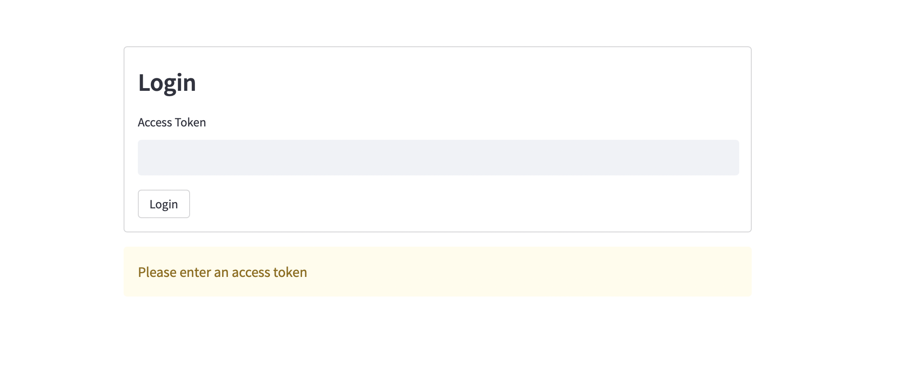

# streamlit-cognito-token-access-authentication

This is a library to authenticate users of a streamlit application that is embedded in a host application using AWS Cognito's access token. Normal Cognito sign in does not work in this use case because Cognito hosted UIs aren't allowed to be embedded in iframes due to security concerns.
An example use case would be an Angular application that has a streamlit app in an iframe. A user would first login to the host angular app and receive an access token.\
The user would then use this access token to sign in to the embedded streamlit app.

## Install
```
pip install streamlit-cognito-token-access-authentication
```

Your streamlit app will first show the Login widget for unauthenticated users:


##

Once a user has their access token authenticated, the full streamlit app will become accessible.

## AWS Cognito Prequisites
There should be two Cognito Clients: the Host App Client and the Streamlit App Client. The Streamlit App Client must have a secret key.

At the root of your project create a .streamlit folder with a secrets.toml file with the following configuration:
COGNITO_USERPOOL_ID = "yourUserpoolId"
COGNITO_DOMAIN = "yourDomain"
COGNITO_GROUP_NAME = "yourGroup"
APP_CLIENT_ID = "yourAppClient"
HOST_APP_CLIENT_ID = "yourHostAppClient"
APP_URI = "yourURI"
REGION = "yourRegion"
HTTP_PROXY = "yourProxy"

## Streamlit Application

On your app.py, copy the following:
```python
import streamlit as st
import time
import pandas as pd
import numpy as np
from streamlit_cognito_authentication import AuthenticationToken

st.set_page_config(page_title="Cognito and Streamlit Demo")

### START streamlit_cognito_authentication code ###
auth_placeholder = st.empty()
with auth_placeholder.container():

    cognito_authenticate = AuthenticationToken()
    if not st.session_state.authenticated:      
        authentication_status, username = cognito_authenticate.login_widget('Login')
        if authentication_status == False:
            st.error("Access token is not valid")
        elif authentication_status == None:
            st.warning("Please enter an access token")
if st.session_state.authenticated:
    auth_placeholder.empty()

    auth_sidebar_placeholder = st.empty()
    with auth_sidebar_placeholder.container():
        cognito_authenticate.logout("Logout")
    if st.session_state.logout:
        auth_sidebar_placeholder.empty()
### END streamlit_cognito_authentication code ###

    # ----- MAINPAGE OF YOUR APP GOES HERE -----
    # ----- REMEMBER TO KEEP YOUR APP CODE INDENTED AT THIS LEVEL -----

    st.title(":bar_chart: Demo app with cognito authentication")
```

